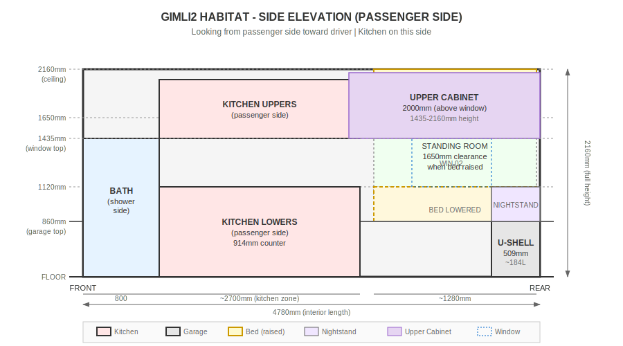

# Gimli2 — Expedition Truck + Habitat Program

Gimli2 is an expedition-truck build program to create a durable, long-duration overland platform optimized for full-time living and remote work. The base vehicle is a Mercedes-Benz 1225 AF (NG80 chassis), being converted into a self-supported global-travel rig with an integrated habitat module (approximately 16 ft). The objective is a vehicle that can reliably handle corrugations, poor roads, and mixed climates while remaining serviceable, safe, and practical for extended international travel.

This repository documents the end-to-end systems engineering of the truck + habitat: structural/subframe integration, entry systems, cabinetry and interior construction, water/grey tanks and plumbing, thermal/heating (diesel/hydronic), and a 24V Victron-based electrical architecture with a large LiFePO₄ bank and a roof solar array (on the order of ~1.2 kW) to support off-grid living. The build is managed with disciplined governance (canonical artifacts, decision logs, and versioning) to prevent design drift across tools, vendors, and iterations—and to preserve a high-quality record suitable for future publication.

---

## What We’re Building

- **Base vehicle:** Mercedes-Benz 1225 AF (NG80 chassis)
- **Habitat module:** ~16 ft expedition habitat for full-time living + remote work
- **Primary design goals:** reliability, serviceability, off-grid autonomy, safety, and documentation completeness
- **Core systems in scope:**
  - Structure & integration (subframe, pass-through, reinforcements)
  - Electrical (24V Victron ecosystem, LiFePO₄ bank, solar, monitoring)
  - Plumbing (fresh + grey, filtration, pumps, winterization considerations)
  - Thermal (diesel/hydronic heating strategy; insulation approach)
  - Interior (cabinetry materials, mounting strategy, durability on corrugations)
  - Security & networking (as required for remote work and travel)

---

## How This Repo Is Organized

This repo is designed so newcomers can understand the project, and contributors can make changes without causing “design drift.”

- `docs/specs/` — Requirements, constraints, acceptance criteria, design targets
- `docs/architecture/` — System architecture, schematics, interface-control notes
- `docs/decisions/` — Decision log / ADR-style records (what we chose and why)
- `docs/vendor/` — Vendor comms, quotes, procurement decisions, lead times
- `cad/` — CAD exports (STEP/DXF), profiles, reference geometry
- `build-log/` — Build log entries, photos/notes, “what changed in the real world”

> The enforceable rules for how changes are proposed and recorded live in `PROJECT_CONSTITUTION.md`.

---

## Working Agreements (High Level)

- Major design choices must be recorded in the decision log before they are treated as “real.”
- Drawings and specs must carry a version and “Last updated” date when modified.
- Unknowns are explicitly marked `TBD` with an owner/action to resolve them.

---

## Habitat Floor Plan

**Key dimensions:**
- Interior: 4780mm (L) × 2280mm (W) × 2160mm (H)
- Kitchen: ~2300mm length × 600mm depth (**passenger side**)
- Floor-to-ceiling cabinets opposite kitchen (**driver side**)
- Bathroom: toilet on **driver side** (below WIN-04), shower on **passenger side**
- Entry door (DOOR-01): **passenger side**, adjacent to shower area
- Kitchen window (WIN-05): **passenger side**, in kitchen zone
- Bathroom window (WIN-04): **driver side**, above toilet
- Garage shell: wall-to-wall (2280mm), 860mm high, with exterior hatches on both sides
- U-shaped dinette with rear bench seating on garage shell top

### Top View — Day Mode (Bed Raised)


### Side Elevation — Passenger Side (Looking Toward Driver)



### Layout Summary

| Element | Location | Notes |
|---------|----------|-------|
| **Kitchen** | Passenger side | Behind bathroom, with WIN-05 window |
| **Floor-to-ceiling cabinets** | Driver side | Opposite kitchen |
| **Toilet** | Driver side (bathroom) | Below WIN-04 window |
| **Shower** | Passenger side (bathroom) | Adjacent to entry door |
| **Entry door (DOOR-01)** | Passenger side | Opens into bathroom/shower area |
| **WIN-04** | Driver side | Bathroom window above toilet |
| **WIN-05** | Passenger side | Kitchen window |
| **Bedside cabinets (lower)** | Both sides | 300mm deep × **660mm long** (ends where WIN-01/WIN-02 start) |
| **Bedside cabinets (upper)** | Both sides | 300mm deep × 2000mm long (above window level) |

### Bedside Cabinet Structure (ZONE-007)

The bedside storage cabinets are split into three vertical zones to avoid blocking the rear windows:

| Zone | Height Range | Depth | Description |
|------|--------------|-------|-------------|
| **Lower** | 0–860mm | 660mm | Bulk storage, ends where windows start |
| **Window** | 860–1435mm | — | No cabinet (window clearance for WIN-01/WIN-02) |
| **Upper** | 1435–2160mm | 2000mm | Full bed length, above window level |

**Window clearance calculation:**
- WIN-01/WIN-02 centers: 1200mm from rear wall, width 1063mm
- Window rear edge: 1200 - 531.5 = **668.5mm** from rear
- Lower cabinet depth: **660mm** (8.5mm clearance from window)

### Interactive 3D Viewer

To explore the habitat in 3D, open the interactive viewer:

```bash
open renders/habitat_zones_3d.html
```

The 3D viewer includes:
- All functional zones (color-coded)
- Day/Night mode toggle (shows bed raised vs lowered)
- Wireframe view option
- Windows, doors, and hatches
- Click zones to highlight

---

## Current Status (Update as Needed)

- [ ] Baseline architecture and subsystem boundaries captured
- [ ] Electrical one-line and parts list stabilized (24V Victron)
- [ ] Plumbing and tank layout finalized (fresh/grey, filtration, winterization)
- [ ] Thermal/insulation strategy selected and documented
- [ ] Entry and exterior integration decisions (steps/ladder, carriers, hatches)
- [ ] Interior cabinetry material and mounting strategy confirmed

---

## Contributing

If you want to contribute, open an issue describing:
1) the problem or improvement,
2) the affected subsystem(s),
3) the tradeoffs you see,
4) any links to relevant artifacts (specs, drawings, vendor data).

Proposed changes that impact architecture, safety, or procurement should include a decision entry in `docs/decisions/`.
